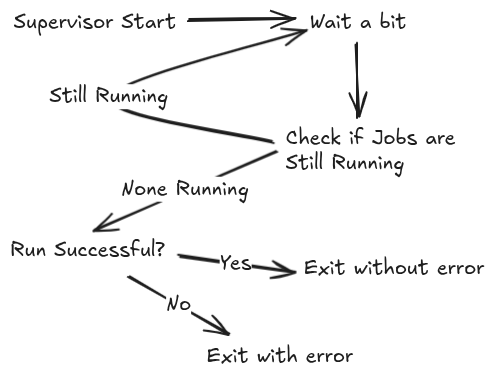

# Supervisor

This is a supervisor that is intended to run and supervise the pipeline-mini on setonix.

Basic run command:
```bash
supervisor-python -e pipeline-mini --account [MY_ACCOUNT] --partition [MY_PARTITION] --dir pipeline_runs
```

## Workflow loop


## Setonix Deployment
The repo also contains an ansible CI workflow for deployment to Setonix. It requires the `PAWSEY_SSH_KEY` Secret set in the CI system.
